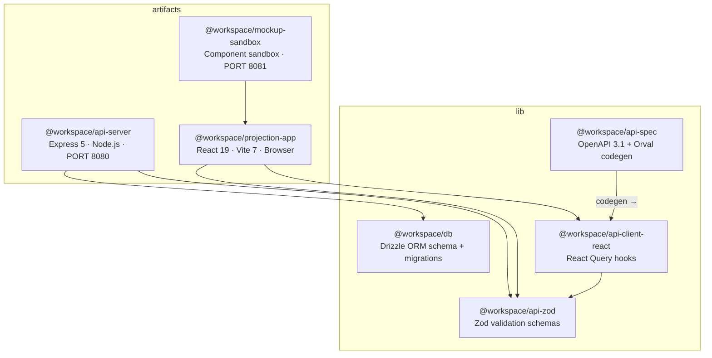
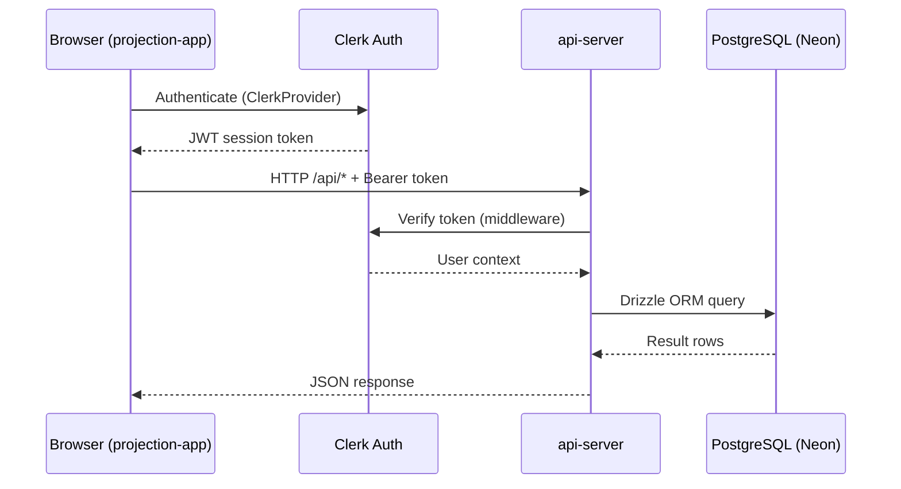
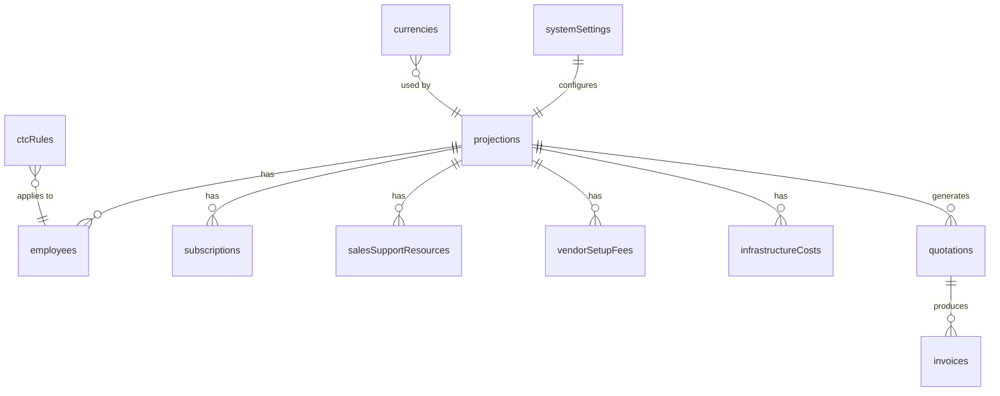
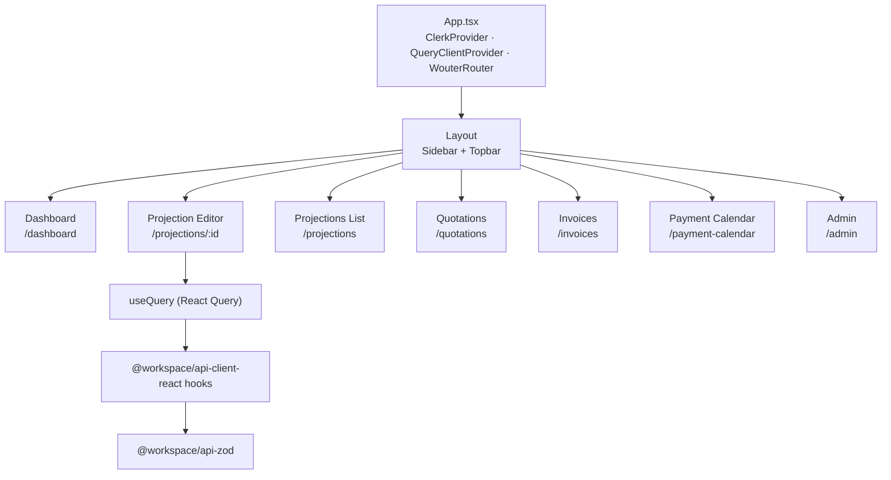
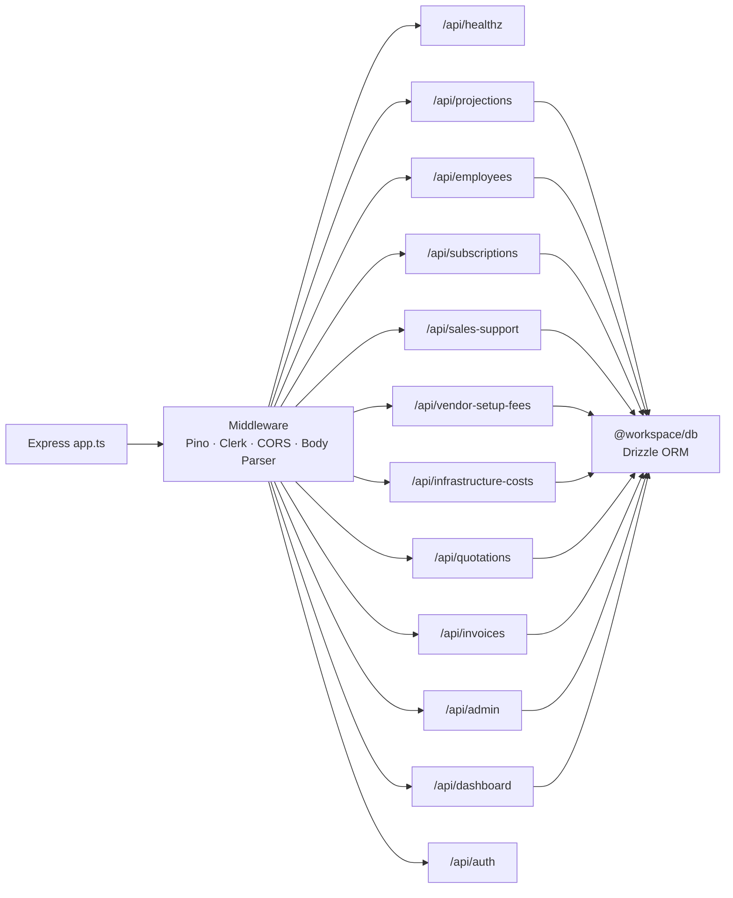
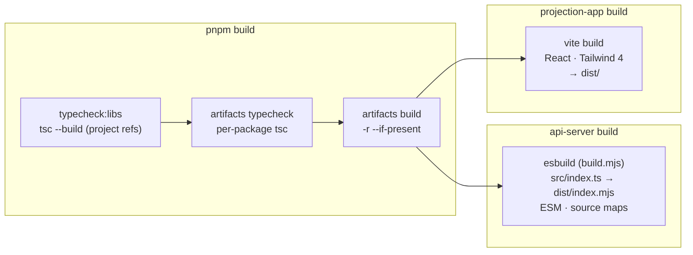

# Architecture — Fiscal Insight AI

> Always read this file at the start of any session. Referenced by CLAUDE.md.

## Monorepo Package Graph

## Request Flow

## Database Schema Relationships

## Frontend Page → Component → Hook Tree

## API Route Map

## Build Pipeline

## Key File Locations

| Concern | Path |
|---|---|
| API entry | `artifacts/api-server/src/index.ts` |
| API app setup | `artifacts/api-server/src/app.ts` |
| API routes dir | `artifacts/api-server/src/routes/` |
| Frontend entry | `artifacts/projection-app/src/main.tsx` |
| Frontend router | `artifacts/projection-app/src/App.tsx` |
| DB schema index | `lib/db/src/schema/index.ts` |
| Drizzle config | `lib/db/drizzle.config.ts` |
| Zod schemas | `lib/api-zod/src/` |
| OpenAPI spec | `lib/api-spec/openapi.yaml` |
| API client hooks | `lib/api-client-react/src/` |
| Shared tsconfig | `tsconfig.base.json` |
| API esbuild | `artifacts/api-server/build.mjs` |
| Vite config | `artifacts/projection-app/vite.config.ts` |
